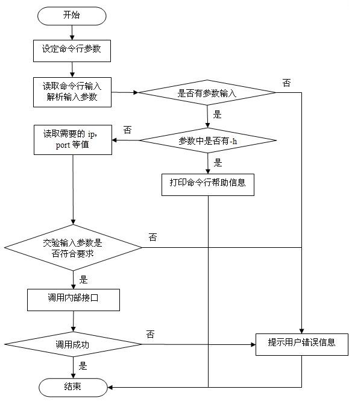

### Java 命令行工具

#### 1. 实验背景

本次作业是 JVM 大作业的预热作业。你需要使用第三方库 Commons CLI，实现一个很小的 Java 命令行工具。

完成本题后，你应该能够理解：

- 命令行程序怎样接收参数。
- 什么是“选项”和“参数”。
- 如何查阅第三方库文档，并把库提供的 API 用到自己的代码里。

一个命令行工具通常会经历三个步骤：

- 定义：提前声明程序支持哪些选项，例如 `-h`、`-p`、`-s`。
- 解析：把用户输入的字符串数组解析成结构化结果，并检查输入是否合法。
- 使用：根据解析结果执行对应逻辑，例如打印帮助信息、打印指定内容、修改状态变量。

以 Java 自带命令为例，在命令行中输入：

```shell
java -h
```

会看到 Java 支持的选项说明。不同版本和语言环境下输出可能不同，但它们的形式大致类似：选项以 `-` 或 `--` 开头，选项后面可能跟着参数。

在本次作业中，我们只实现三个选项，规模比 `java -h` 小很多。一个典型命令行工具的流程如下：



### 2. 实验要求

#### 2.1 实验输入

测试用例会调用 `CommandLineUtil` 中的 `main(String[] args)` 方法。你可以把 `args` 理解为用户在命令行里输入的一串内容按空格切分后的结果。

例如：

```shell
-p hello arg0
```

可以理解为：

```java
new String[]{"-p", "hello", "arg0"}
```

本题中有两类参数：

- 选项参数：跟在某个选项后面、属于这个选项的值。例如 `-p hello` 中的 `hello` 是 `-p` 的选项参数。
- 用户参数：不属于任何选项的普通参数。例如 `-p hello arg0` 中的 `arg0` 是用户参数。

合法输入需要满足以下要求：

- 如果一个选项需要参数，那么参数必须存在，并且紧跟在该选项后面。中间可以有一个或多个空格。
- 选项和用户参数的顺序没有固定要求。例如 `-p hello arg0` 和 `arg0 -p hello` 都可以是合法输入。
- 当输入中不包含 `-h` 或 `--help` 时，必须至少有一个用户参数。

下面是一些例子：

| 输入 | 说明 |
|---|---|
| `-h` | 合法，打印帮助信息 |
| `-h arg0 -s -p hello` | 合法，优先打印帮助信息，不执行 `-s` 和 `-p` |
| `-s arg0` | 合法，将 `sideEffect` 置为 `true` |
| `-p hello arg0` | 合法，打印 `hello` |
| `arg0 -p hello arg1` | 合法，打印 `hello`，用户参数可以出现在选项前后 |
| `-p` | 不合法，`-p` 缺少选项参数 |
| `-s` | 不合法，不包含 `-h` 时缺少用户参数 |
| `-p hello` | 不合法，不包含 `-h` 时缺少用户参数 |

#### 2.2 实验输出

程序需要通过标准输出打印结果。也就是说，请使用：

```java
System.out.println(...);
```

不同情况的输出要求如下：

- 输入合法且需要输出时，打印对应业务逻辑的结果。
- `-p` 缺少参数时，打印 Commons CLI 抛出的 `ParseException` 的错误信息，并调用 `System.exit(-1)` 退出。
- 不包含 `-h` 或 `--help` 且缺少用户参数时，打印 `CommandLineUtil.WRONG_MESSAGE`。

#### 2.3 实验要求

你需要在 `src/main/java/edu/nju/CommandLineUtil.java` 中补全代码，实现以下选项：

| 参数 | 主要功能 |
|---|---|
| `-h` / `--help` | 打印所有预定义选项与用法。本次测试只要求输出 `help` |
| `-p arg` / `--print arg` | 打印 `arg` |
| `-s` | 将当前 `CommandLineUtil` 对象中的 `sideEffect` 变量置为 `true` |

注意：为了方便自动测试，`-h` / `--help` 的标准输出固定检查为：

```text
help
```

也就是说，代码中可以直接使用：

```java
System.out.println("help");
```

通过测试后，你可以自行尝试使用 `HelpFormatter` 打印更完整的帮助信息。

其他规则：

1. `-p` / `--print` 后面缺少参数时，应打印 `ParseException` 的错误信息，并调用 `System.exit(-1)`。
2. 只要输入中包含 `-h` 或 `--help`，就只打印帮助信息，不执行 `-s` 和 `-p` 对应的业务逻辑。
3. 但是，`-h` 不能掩盖语法错误。例如 `-h -p` 中的 `-p` 仍然缺少参数，应按第 1 条处理。
4. 当输入中不包含 `-h` 或 `--help` 时，如果用户参数为空，应输出 `WRONG_MESSAGE`。

#### 2.4 代码指导

本题已经在 `CommandLineUtil` 中为你准备了几个字段：

```java
private static CommandLine commandLine;
private static CommandLineParser parser = new DefaultParser();
private static Options options = new Options();
```

它们分别负责：

- `options`：保存程序支持的所有选项规则。
- `parser`：根据 `options` 解析输入。
- `commandLine`：保存解析后的结果，后续可以通过它查询用户输入了哪些选项、每个选项的参数是什么、还剩下哪些用户参数。

建议按下面的顺序完成代码。

Step 1：定义选项

可以在 `static {}` 代码块中调用 `options.addOption(...)`，把本题要求的三个选项加入 `options`。

常用构造方法如下：

```java
new Option("h", "help", false, "Print help message")
new Option("p", "print", true, "Print arg")
new Option("s", false, "Make some side effects")
```

其中第三个参数表示这个选项是否需要参数：`true` 表示需要，`false` 表示不需要。

Step 2：解析输入

在 `parseInput(String[] args)` 中调用：

```java
commandLine = parser.parse(options, args);
```

如果输入不符合选项规则，例如 `-p` 后面没有参数，`parse` 会抛出 `ParseException`。你需要捕获它，打印错误信息，然后退出程序：

```java
catch (ParseException e) {
    System.out.println(e.getMessage());
    System.exit(-1);
}
```

Step 3：处理解析结果

解析成功后，可以使用以下方法查询输入内容：

```java
commandLine.hasOption("h")
commandLine.hasOption("p")
commandLine.getOptionValue("p")
commandLine.getArgs()
```

建议处理顺序如下：

1. 先判断是否有 `-h` 或 `--help`，有则打印 `help` 并返回。
2. 再判断 `commandLine.getArgs().length` 是否为 `0`，如果为 `0`，说明缺少用户参数，打印 `WRONG_MESSAGE` 并返回。
3. 最后分别处理 `-s` 和 `-p`。

更多 Commons CLI 的用法可以参考官方文档：

- Usage: <https://commons.apache.org/proper/commons-cli/usage.html>
- Javadoc: <https://commons.apache.org/proper/commons-cli/javadocs/api-release/index.html>
